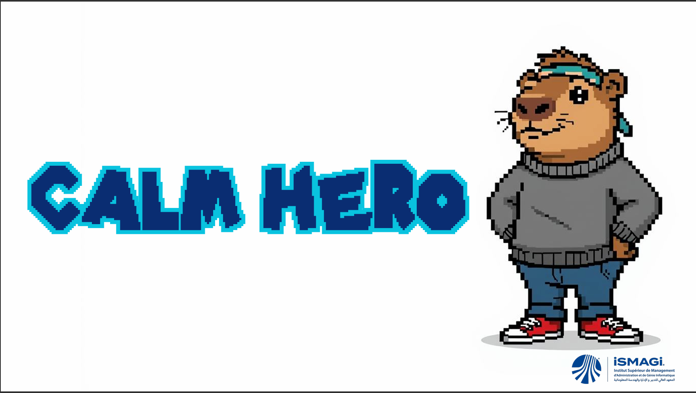

# Calm Hero

Calm Hero is our gamified child-health solution for the Game4Health hackathon. It combines a parent-facing dashboard, therapy pack progress tracking, medication adherence, rewards, and EMG-driven stress analytics. The project placed 3rd in the Game4Health hackathon.

## Pitch Deck



## What’s in the repo

- A React + Vite web app for the parent portal.
- A Godot game prototype and staged design iterations under `frogger-project-stages/`.
- An ESP32 EMG websocket sketch under `esp32_emg/`.
- Hackathon showcase assets in `docs/showcase/`.

## Core features

- Parent dashboard with child profile, streaks, and medication adherence.
- Therapy packs and session history for game-based interventions.
- Progress analytics with charts for HP, XP, activity, and rewards.
- Reward system with unlockable badges.
- Settings page for notifications, security, and therapist contact.
- EMG-inspired monitoring views for stress, calm zone, and BDNF trends.

## Tech stack

- React 19
- Vite
- Recharts
- Lucide React icons
- Godot 4 project files
- ESP32 Arduino sketch

## Project structure

```text
.
├── docs/showcase/          # Screenshots and showcase assets
├── src/                    # React app source
│   ├── components/         # Shared UI pieces
│   ├── context/            # Theme state
│   ├── data/               # Mock dashboard data
│   └── pages/              # Dashboard sections
├── public/                 # Static public assets
├── esp32_emg/              # EMG websocket firmware sketch
├── frogger-project-stages/  # Godot prototype and stage snapshots
├── index.html
├── package.json
└── vite.config.js
```

## Getting started

### Prerequisites

- Node.js 18 or newer
- npm

### Install

```bash
npm install
```

### Run locally

```bash
npm run dev
```

### Build for production

```bash
npm run build
```

### Lint the code

```bash
npm run lint
```

## Showcase Assets

The cleaned screenshot set lives in `docs/showcase/`. It includes the original hackathon visuals that were previously scattered in the repository root.

## Optional prototypes

### Godot project

Open `frogger-project-stages/project.godot` in Godot 4 to explore the game prototype and stage assets.

### ESP32 EMG sketch

Upload `esp32_emg/emg_websocket.ino` to an ESP32 board if you want to experiment with the EMG websocket data source used by the project concept.

## Notes

- `dist/` and `node_modules/` are generated locally and should not be committed.
- The repo intentionally keeps the React dashboard and the prototype/game assets together so the full hackathon story stays in one place.
